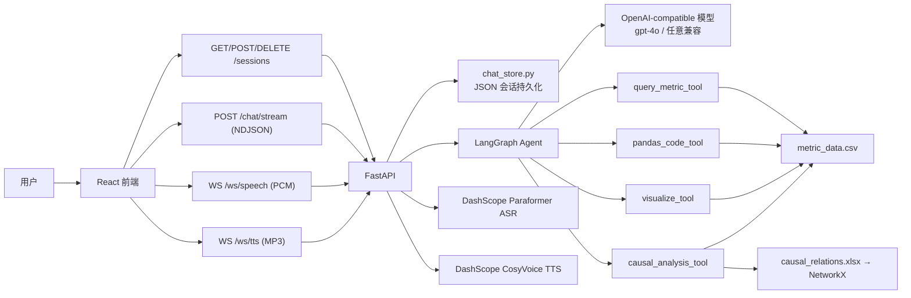
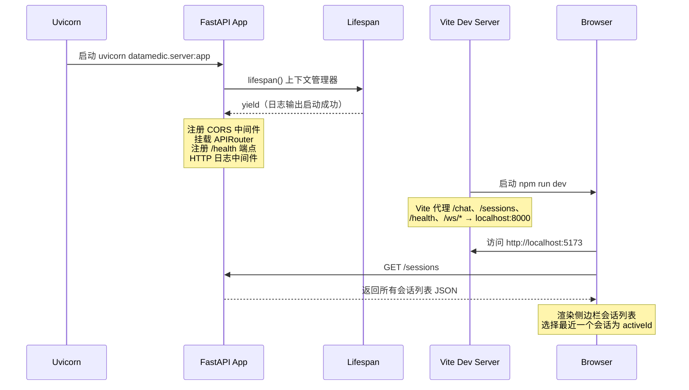
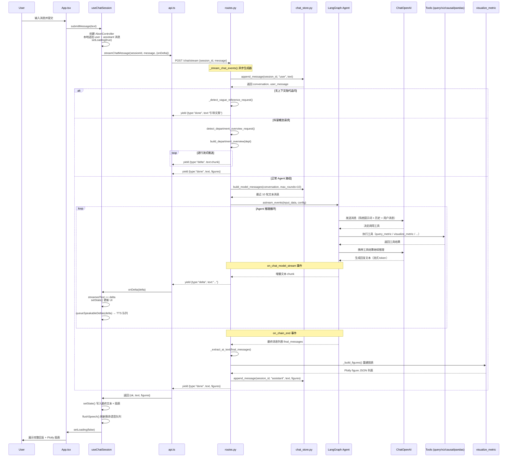
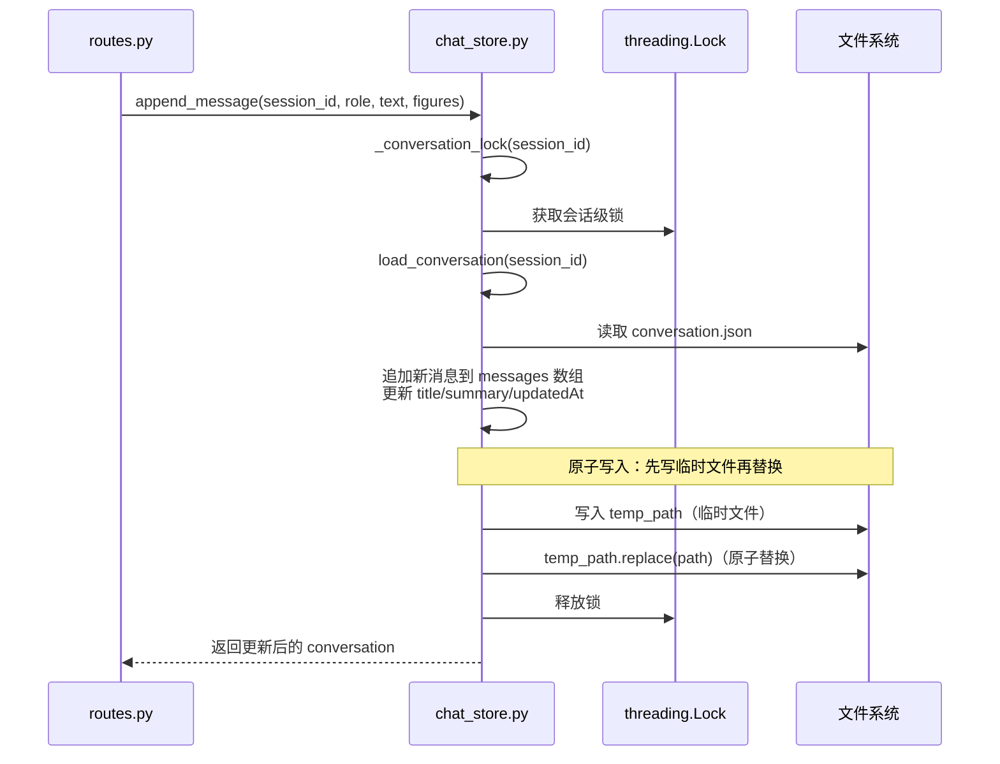
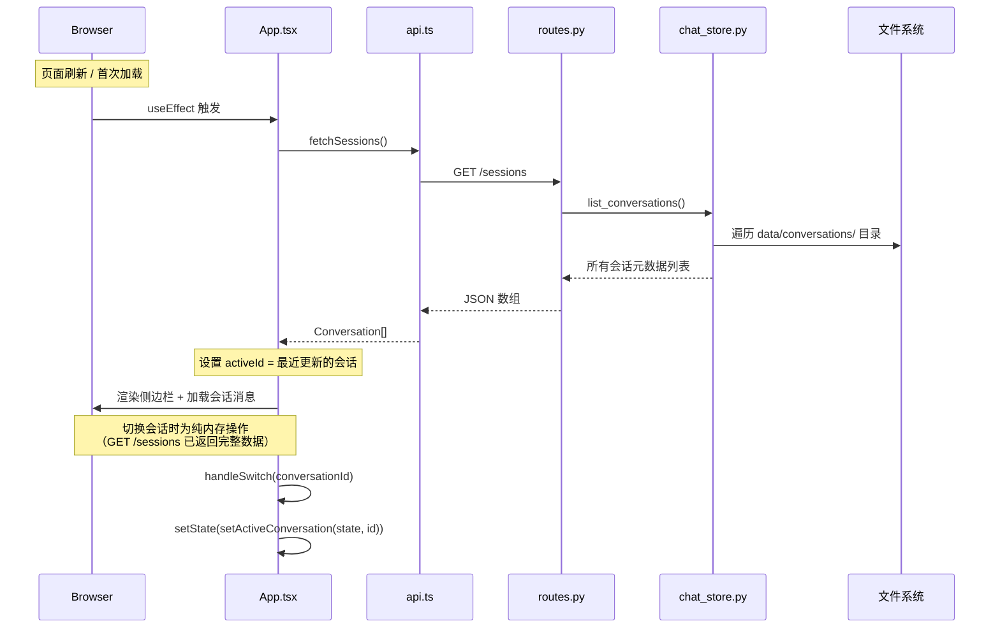
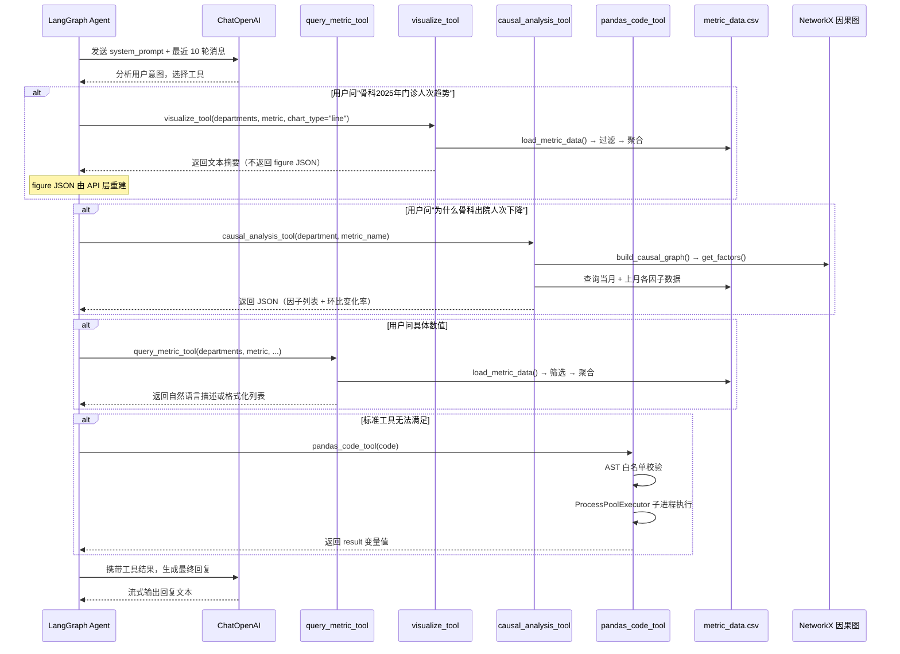
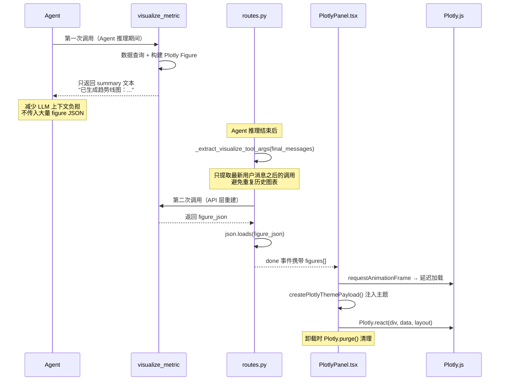
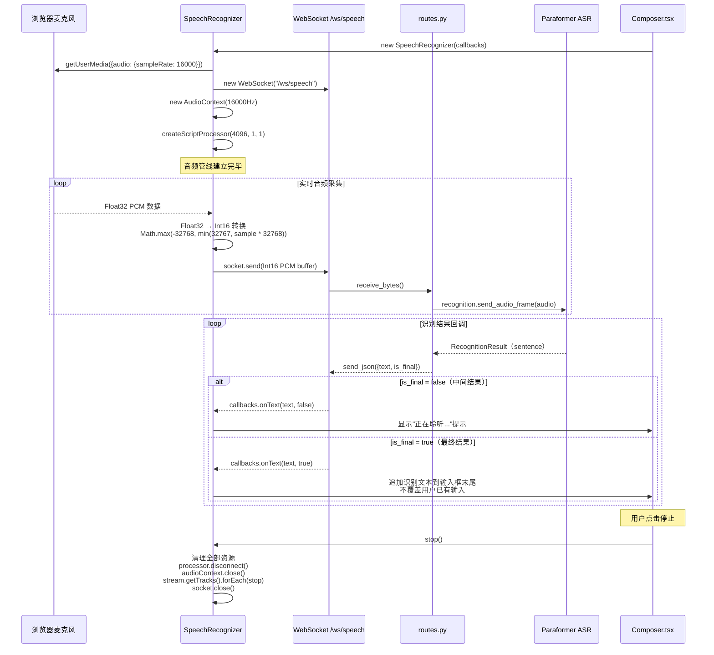
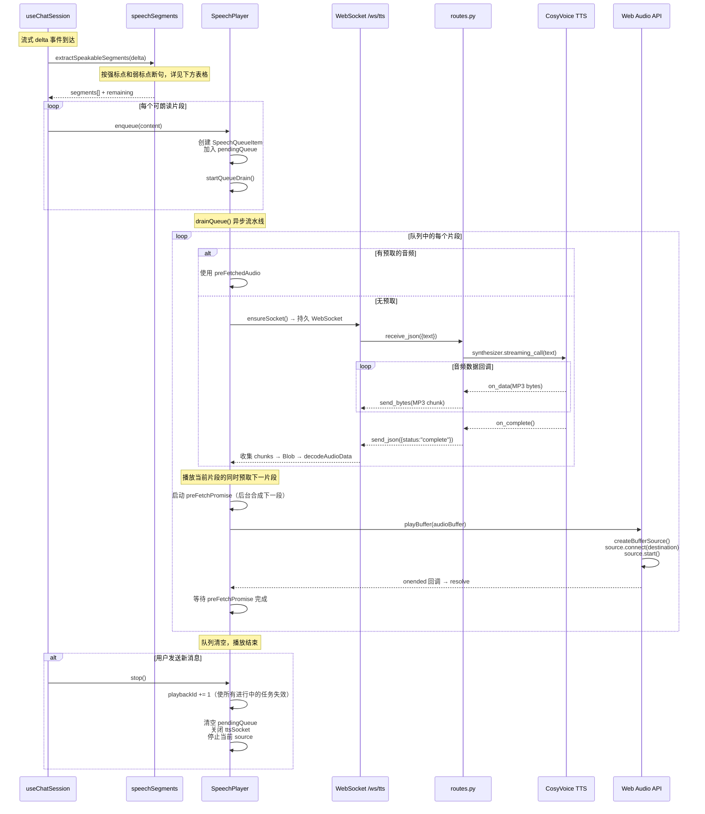
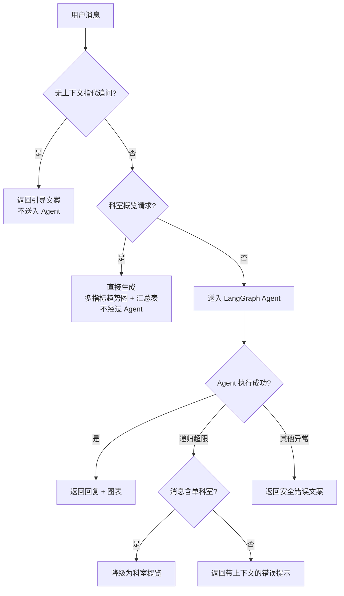

<p align="center">
  
</p>

# DataMedic — 医院运营指标智能分析助手

DataMedic 是一个面向医院运营数据分析的智能问答应用。用户用中文描述分析需求（科室指标查询、趋势变化、异常原因、多指标关系），系统通过 LangGraph Agent 驱动本地数据工具完成查询、统计、图表生成和因果解释，结果以流式对话、Plotly 图表和语音朗读的形式呈现在 React 前端。

项目内置 2022 年 1 月至 2025 年 12 月的医院运营指标样例数据，覆盖 **20 个科室**、**51 项指标**和 **48,960 条**指标记录，并附带一张包含 51 个节点、49 条边的指标因果关系表用于波动解释。

## 运行效果


---

## 核心能力

| 能力 | 说明 |
| --- | --- |
| 自然语言查询 | 门诊人次、出院人次、手术人次、住院收入、床位使用率等 51 项指标的科室级查询 |
| 多维分析 | 任意科室组合 × 时间范围 × 聚合方式（合计/均值/最大/最小）× 排名 |
| 图表体系 | 趋势折线、面积、柱状对比、分组柱状、堆叠构成、饼图占比、热力分布、散点关系、气泡关系、箱线分布、直方分布、瀑布环比、KPI 指标卡、明细表 |
| 流式输出 | NDJSON 逐 token 推送，前端打字机渲染，图表在文本完成后一次性展示 |
| 会话持久化 | 后端 JSON 文件持久化，原子写入防损坏；刷新页面或重启服务后会话不丢失 |
| 上下文控制 | 每次模型调用只携带最近 10 轮文本对话，历史图表 JSON 不传入模型，避免上下文爆炸 |
| 语音输入 | 浏览器麦克风 → PCM 音频流 → WebSocket → DashScope Paraformer 实时识别 → 文本追加到输入框 |
| 语音输出 | 流式文本按标点断句 → 持久 WebSocket → DashScope CosyVoice TTS → MP3 音频块 → Web Audio API 流水线化播放 |
| 因果分析 | 基于 NetworkX 有向图，自动查找上游因子指标并计算环比变化率，解释波动原因 |
| 科室概览 | 对"分析一下儿科的数据"等宽泛请求，直接生成多指标趋势折线图 + 核心指标汇总表 |

---

## 技术栈

| 层级 | 技术 | 用途 |
| --- | --- | --- |
| 前端框架 | React 19、TypeScript、Vite | SPA 应用壳、组件化 UI |
| 前端图表 | Plotly.js（按需注册 trace 模块） | 渲染后端生成的 Plotly figure JSON |
| 前端语音 | Web Audio API、MediaStream | 麦克风采集、音频解码与播放 |
| 后端框架 | FastAPI、Pydantic、Uvicorn | REST API、WebSocket、请求校验 |
| Agent 框架 | LangGraph（create_agent）、LangChain | LLM 工具编排、对话记忆管理 |
| LLM | OpenAI-compatible Chat API | gpt-4o / 任意兼容模型 |
| 数据分析 | Pandas、Plotly、NetworkX、OpenPyXL | CSV 数据查询、图表生成、因果图遍历 |
| 语音服务 | DashScope Paraformer（ASR）、CosyVoice（TTS） | 实时语音识别与合成 |
| 测试 | Pytest（124 用例）、Vitest + Testing Library + jsdom（55 用例） | 后端单元测试、前端组件测试 |

---

## 项目结构

```text
datamedic/
├── data/
│   ├── metric_data.csv              # 医院运营指标样例数据（48,960 行）
│   └── causal_relations.xlsx        # 指标因果关系定义（51 节点 / 49 边）
│
├── src/datamedic/
│   ├── server.py                    # FastAPI 应用入口：CORS、日志中间件、lifespan
│   ├── config.py                    # 环境变量加载：LLM、语音、数据路径、CORS 白名单
│   ├── chat_store.py                # 后端 JSON 会话持久化（CRUD + 锁 + LRU）
│   │
│   ├── api/
│   │   ├── routes.py                # /chat、/chat/stream、/sessions、/ws/speech、/ws/tts
│   │   └── schemas.py               # Pydantic 请求/响应模型（ChatRequest、ChatResponse 等）
│   │
│   ├── agent/
│   │   ├── agent.py                 # LangGraph Agent 组装：LLM + 4 工具 + LRU MemorySaver
│   │   └── prompts.py               # 系统提示词：动态注入科室列表、指标列表、当前日期
│   │
│   ├── tools/
│   │   ├── query_tool.py            # 结构化指标查询：多科室筛选、聚合、排序、排名
│   │   ├── pandas_tool.py           # 受限 Pandas 代码执行：AST 白名单校验 + ProcessPoolExecutor 超时
│   │   ├── viz_tool.py              # Plotly 图表生成：14 种图表类型，JSON 序列化
│   │   ├── causal_tool.py           # 因果分析：环比变化计算、因子分类归因
│   │   ├── department_overview.py   # 科室概览：多指标趋势 + 汇总表
│   │   └── validation.py            # 共享参数校验：科室、指标、时间、聚合、图表类型
│   │
│   └── data/
│       ├── loader.py                # CSV 数据加载与缓存（RLock 双检锁）
│       └── causal_graph.py          # NetworkX 因果图构建与查询
│
├── frontend/src/
│   ├── App.tsx                      # 应用壳：侧边栏、聊天线程、输入区、语音控制
│   ├── App.css                      # 全局样式（CSS 变量 + 响应式）
│   ├── api.ts                       # HTTP/NDJSON 客户端：fetch、stream、session CRUD
│   ├── storage.ts                   # 前端内存状态管理 + localStorage 降级兜底
│   ├── voice.ts                     # 语音客户端：SpeechRecognizer（STT）、SpeechPlayer（TTS）
│   ├── speechSegments.ts            # 文本断句：强/弱标点符号分段，用于 TTS 排队
│   ├── plotly.ts                    # Plotly.js 按需加载：仅注册项目使用的 8 种 trace
│   ├── chartTheme.ts                # 图表主题适配：透明背景、统一配色、hover 样式
│   ├── format.ts                    # 时间格式化工具
│   ├── types.ts                     # 核心类型定义 + isRecord 类型守卫
│   │
│   ├── components/
│   │   ├── Sidebar.tsx              # 侧边栏：会话列表、新建、删除确认
│   │   ├── Composer.tsx             # 消息输入区：文本输入 + 语音按钮
│   │   ├── MessageList.tsx          # 消息列表：过滤空消息、渲染图表面板
│   │   ├── PlotlyPanel.tsx          # 图表面板：异步挂载、主题注入、卸载清理
│   │   ├── Welcome.tsx              # 欢迎页：示例问题快捷输入
│   │   └── StatusPill.tsx           # 状态标签：数据范围、科室数、指标数
│   │
│   └── hooks/
│       └── useChatSession.ts        # 聊天会话 Hook：流式消息、语音分段、状态更新
│
├── tests/                           # 后端测试（124 用例）
│   ├── test_api.py                  # API 端点、流式响应、会话、错误处理
│   ├── test_agent.py                # 系统提示词、LRU MemorySaver
│   ├── test_chat_store.py           # 会话持久化 CRUD
│   ├── test_query_tool.py           # 指标查询工具
│   ├── test_viz_tool.py             # 图表生成工具（14 种类型全覆盖）
│   ├── test_causal_tool.py          # 因果分析工具
│   ├── test_pandas_tool.py          # Pandas 代码执行沙箱
│   ├── test_validation.py           # 参数校验函数
│   ├── test_loader.py               # 数据加载与缓存
│   ├── test_causal_graph.py         # 因果图构建与查询
│   ├── test_department_overview.py  # 科室概览
│   └── conftest.py                  # 共享 fixtures（按需扩展）
│
└── frontend/src/                    # 前端测试（55 用例，与源码同目录）
    ├── App.test.tsx                 # App 组件集成测试
    ├── api.test.ts                  # API 客户端测试
    ├── storage.test.ts              # 存储层测试
    ├── voice.test.ts                # 语音客户端测试
    ├── speechSegments.test.ts       # 断句逻辑测试
    ├── plotly.test.ts               # Plotly 加载器测试
    ├── chartTheme.test.ts           # 图表主题测试
    └── viteConfig.test.ts           # Vite 代理配置测试
```

---

## 系统架构



---

## 核心运行逻辑

### 1. 启动流程



后端采用**延迟初始化**策略——Agent 不在服务启动时创建，而是在第一次 `/chat/stream` 请求到达时才实例化 LLM 和工具集，避免空跑服务占用模型资源：

```python
# src/datamedic/api/routes.py
_agent = None
_agent_lock = threading.Lock()

def get_agent():
    global _agent
    if _agent is None:
        with _agent_lock:
            if _agent is None:
                from datamedic.agent.agent import create_agent_graph
                _agent = create_agent_graph()
    return _agent
```

---

### 2. 流式对话 — 完整调用链路

这是系统最核心的数据流，从用户输入到最终渲染，经历**前端发送 → 后端编排 → Agent 推理 → 流式回传 → 前端渲染**五个阶段：



#### 后端流式推送协议（NDJSON）

每行一个 JSON 对象，以 `\n` 分隔，共三种事件类型：

```json
{"type":"delta","text":"增量文本片段"}
{"type":"done","text":"完整回复文本","figures":[{"data":[...],"layout":{...}}]}
{"type":"error","text":"错误说明"}
```

#### 前端流式消费核心代码

```typescript
// frontend/src/api.ts — streamChatMessage
const reader = response.body.getReader();
const decoder = new TextDecoder();
let buffer = "";

while (true) {
  const { value, done } = await reader.read();
  if (done) break;
  buffer += decoder.decode(value, { stream: true });
  const lines = buffer.split("\n");
  buffer = lines.pop() ?? "";    // 保留不完整行
  lines.forEach(consumeLine);     // 逐行解析 StreamEvent
}
```

---

### 3. 会话持久化 — 保存与加载

会话数据以后端 JSON 文件为**唯一事实来源**，每个会话保存为独立文件：

```
data/conversations/<url-encoded-session-id>/conversation.json
```

#### JSON 文件结构

```json
{
  "id": "uuid",
  "title": "会话标题（取自首条用户消息前 15 字）",
  "summary": "最近一条消息文本",
  "createdAt": "2026-05-15T00:00:00.000Z",
  "updatedAt": "2026-05-15T00:00:00.000Z",
  "messages": [
    {
      "id": "uuid",
      "role": "user | assistant",
      "text": "消息内容",
      "figures": [{ "data": [], "layout": {} }],
      "createdAt": "2026-05-15T00:00:00.000Z"
    }
  ]
}
```

#### 保存流程（原子写入）



**核心安全设计**：

```python
# src/datamedic/chat_store.py — 原子写入防止半写损坏
def _save_conversation(conversation: dict, root: Path | None = None) -> None:
    path = _conversation_path(conversation["id"], root)
    path.parent.mkdir(parents=True, exist_ok=True)
    temp_path = path.with_suffix(".tmp")
    temp_path.write_text(json.dumps(conversation, ensure_ascii=False, indent=2), encoding="utf-8")
    temp_path.replace(path)  # POSIX 下为原子操作
```

**并发安全 — LRU 锁池**：每个会话拥有独立的 `threading.Lock`，锁池上限 500，超出时按 LRU 淘汰未被持有的锁；若所有锁均被持有则强制淘汰最旧的锁以防止死循环。

```python
# src/datamedic/chat_store.py — LRU 锁淘汰
while len(_lock_access_order) > MAX_LOCKS:
    evicted_key = _lock_access_order.pop(0)
    evicted_lock = _conversation_locks.get(evicted_key)
    if evicted_lock is not None and evicted_lock.locked() and len(_lock_access_order) >= MAX_LOCKS:
        _lock_access_order.append(evicted_key)  # 被持有的锁放回队列末尾
        continue
    _conversation_locks.pop(evicted_key, None)  # 安全淘汰
```

#### 加载流程



---

### 4. Agent 工具编排

Agent 由 `src/datamedic/agent/agent.py` 使用 LangGraph 的 `create_agent()` 组装：

```
ChatOpenAI(LLM) + 4 个 @tool 工具 + 系统提示词 + LRUMemorySaver
```



#### 四个工具一览

| 工具 | 函数签名 | 能力 |
| --- | --- | --- |
| `query_metric_tool` | `(departments, metric_name, year_start, year_end, month_start, month_end, aggregation, sort_by, top_n)` | 单值查询、多科室对比、聚合统计、排名 |
| `pandas_code_tool` | `(code)` | 在受限环境中执行 Pandas 代码，变量 `df` 为完整 DataFrame |
| `visualize_tool` | `(departments, metric_name, ..., chart_type, group_by, secondary_metric_name, size_metric_name, top_n)` | 生成 14 种 Plotly 图表，给 LLM 只返回文本摘要 |
| `causal_analysis_tool` | `(department, metric_name, year?, month?)` | 因果图查找上游因子，计算环比变化率 |

每个工具调用通过 `_timed_tool` 包装，记录执行耗时日志。

#### Pandas 沙箱安全

`pandas_code_tool` 是安全最敏感的工具，采用多层防护：

```python
# src/datamedic/tools/pandas_tool.py — 三层防护

# 第一层：AST 白名单校验
def _validate_code(code: str) -> str | None:
    tree = ast.parse(code)
    for node in ast.walk(tree):
        if isinstance(node, (ast.Import, ast.ImportFrom)):
            return "禁止使用 import 语句"
        if isinstance(node, (ast.FunctionDef, ast.ClassDef)):
            return "禁止定义函数或类"
        # ... 禁止文件 I/O、循环、异常处理等

# 第二层：受限 builtins
SAFE_BUILTINS = {"abs": abs, "len": len, "sum": sum, "sorted": sorted, ...}
exec(code, {"__builtins__": SAFE_BUILTINS, "df": df.copy(), "pd": pd, "result": None})

# 第三层：ProcessPoolExecutor 超时隔离
executor = ProcessPoolExecutor(max_workers=1)
future = executor.submit(_exec_in_subprocess, code)
result = future.result(timeout=TIMEOUT_SECONDS)  # 5 秒超时
executor.shutdown(wait=False, cancel_futures=True)  # 非阻塞清理
```

---

### 5. 图表生成与渲染

Agent 调用 `visualize_tool` 时的数据流有一个精妙的设计——**两次执行**：



**Plotly 按需加载**（`plotly.ts`）：只注册 8 种 trace 模块（bar、box、heatmap、histogram、indicator、pie、table、waterfall），而非完整 Plotly.js，减少约 60% 的首屏加载体积。

---

### 6. 语音输入 — 语音转文字（STT）

语音输入采用浏览器端实时采集 + 后端 DashScope Paraformer 识别的架构：



**关键实现细节**：

- `ScriptProcessorNode` 每次回调 4096 个采样点，前端将 Float32 归一化音频转为 Int16 PCM 格式
- DashScope 回调运行在 SDK 的内部线程中，通过 `asyncio.run_coroutine_threadsafe()` 安全地调度到 FastAPI 的事件循环
- `_handle_dashscope_ws` 上下文管理器统一处理 WebSocket 断连、SDK 缺失、运行时异常等错误场景

---

### 7. 语音输出 — 文字转语音（TTS）

语音输出是系统中最复杂的异步流水线，涉及**文本断句 → WebSocket 合成 → 音频缓冲 → 顺序播放**四个阶段：



**关键设计**：

1. **持久 WebSocket**：整个播放周期只建立一个 TTS 连接（`ensureSocket()`），消除每段新建连接的握手开销
2. **合成与播放流水线化**：`drainQueue()` 中，当前片段通过 `playBuffer()` 播放时，同时通过 `preFetchPromise` 预合成下一片段的音频，存入 `preFetchedAudio`
3. **playbackId 打断机制**：`stop()` 递增 `playbackId`，所有异步操作在关键点检查 `playbackId !== this.playbackId` 时自动退出，实现无竞态打断
4. **断句策略**（`speechSegments.ts`）：

| 断句类型 | 触发标点 | 条件 |
| --- | --- | --- |
| 强断句 | `。！？!?；;` | 立即断句 |
| 弱断句 | `，,、：:` | 累积片段 ≥ 22 字符后断句 |

---

### 8. 前置拦截与降级

API 层在调用 Agent 前执行多层拦截，减少不必要的 LLM 调用：



**三层拦截逻辑**：

1. **无上下文指代追问检测**：消息含指代词（"这种"、"这个"）+ 因果意图（"为什么"、"下降"）但未指明具体指标，且历史无图表上下文 → 直接引导
2. **科室概览检测**：消息提到单一科室 + 宽泛术语（"分析"、"数据"、"看看"）但未指定具体指标 → 直接生成概览
3. **递归超限降级**：Agent 抛出 `GRAPH_RECURSION_LIMIT` 错误且消息含单科室 → 降级为科室概览

---

### 9. 数据层设计

#### CSV 数据加载（loader.py）

```python
# src/datamedic/data/loader.py — RLock 双检锁缓存
_cache: pd.DataFrame | None = None
_cache_lock = threading.RLock()

def load_metric_data() -> pd.DataFrame:
    global _cache
    if _cache is not None:
        return _cache
    with _cache_lock:
        if _cache is not None:    # 双检锁
            return _cache
        df = pd.read_csv(METRIC_DATA_PATH)
        df["date"] = df["年份"].astype(str) + "-" + df["月份"].astype(int).astype(str).str.zfill(2)
        _cache = df
        return _cache
```

- 首次访问时加载 `metric_data.csv`（48,960 行），生成 `date` 辅助列（如 "2025-06"）
- `get_departments()` 和 `get_metrics()` 从缓存 DataFrame 派生，无需重复 I/O

#### 因果图构建（causal_graph.py）

- 从 `causal_relations.xlsx` 读取 49 条因果关系
- 构建 NetworkX 有向图（因子 → 结果），边属性含类别
- `get_factors(G, metric_name)`：查询上游因子，按类别分组返回
- `get_drilldown(G, metric_name)`：识别可进一步下钻的中间节点
- 同样使用 RLock 双检锁缓存

---

## API 概览

| 方法 | 路径 | 请求体 | 响应 |
| --- | --- | --- | --- |
| `GET` | `/health` | - | `{"status": "ok"}` |
| `POST` | `/chat` | `ChatRequest` | `ChatResponse`（JSON） |
| `POST` | `/chat/stream` | `ChatRequest` | `application/x-ndjson` 流 |
| `GET` | `/sessions` | - | `list[ConversationRecord]` |
| `POST` | `/sessions` | - | `ConversationRecord` |
| `GET` | `/sessions/{id}` | - | `ConversationRecord` |
| `DELETE` | `/sessions/{id}` | - | `{"ok": true}` |
| `WS` | `/ws/speech` | 二进制 PCM 音频帧 | JSON 识别结果 |
| `WS` | `/ws/tts` | JSON `{"text": "..."}` | 二进制 MP3 + JSON 状态 |

**ChatRequest**：
```json
{
  "session_id": "conversation-uuid",
  "message": "展示 2025 年骨科出院人次趋势"
}
```

**NDJSON 流式事件**：
```json
{"type": "delta", "text": "增量文本"}
{"type": "done", "text": "完整回复文本", "figures": [{ "data": [...], "layout": {...} }]}
{"type": "error", "text": "错误说明"}
```

---

## 快速开始

### 环境要求

- Python 3.11+（推荐 3.12+）
- Node.js 18+、npm
- OpenAI-compatible 聊天模型服务（API Key + Base URL）
- DashScope API Key（语音输入/输出需要，文本分析不需要）

### 安装与配置

```bash
# 1. 克隆项目
git clone <repo-url> && cd datamedic

# 2. 后端依赖
python3 -m venv .venv && source .venv/bin/activate
pip install -e ".[dev]"
# 或使用 uv: uv sync

# 3. 环境变量
cp .env.example .env
# 编辑 .env，填入 OPENAI_API_KEY、OPENAI_BASE_URL、MODEL_NAME
# 语音功能需填入 DASHSCOPE_API_KEY

# 4. 前端依赖
cd frontend && npm install
```

关键环境变量：

```bash
# LLM
OPENAI_API_KEY=sk-your-key
OPENAI_BASE_URL=https://api.openai.com/v1
MODEL_NAME=gpt-4o

# 语音（可选）
DASHSCOPE_API_KEY=sk-your-key
STT_MODEL=paraformer-realtime-v2
TTS_MODEL=cosyvoice-v2
TTS_VOICE=longxiaochun_v2

# 数据路径（可选）
CONVERSATION_DATA_DIR=data/conversations
CORS_ALLOW_ORIGINS=http://localhost:5173,http://127.0.0.1:5173
LOG_LEVEL=INFO
```

### 启动

```bash
# 终端 1：后端
source .venv/bin/activate
uvicorn datamedic.server:app --host 127.0.0.1 --port 8000 --reload

# 终端 2：前端
cd frontend && npm run dev
```

访问 `http://localhost:5173`。Vite 开发服务器自动代理 `/chat`、`/sessions`、`/health`、`/ws/speech`、`/ws/tts` 到 `localhost:8000`。

### 测试

```bash
# 后端（124 用例）
python3 -m pytest tests/ -v

# 前端（55 用例）
cd frontend && npx vitest run
```

---

## 开发约定

- **分层原则**：API 层只做请求编排和前置拦截；业务逻辑在 `tools/`、`chat_store.py`、`data/` 中
- **图表协议**：图表始终以 Plotly figure JSON 格式保存和传输，前后端无需额外协议
- **会话事实来源**：后端 JSON 文件是持久化唯一事实来源
- **错误安全**：所有面向用户的错误消息不泄露内部路径、token 或技术细节
- **测试覆盖**：重点关注工具参数校验、图表生成、会话持久化、流式响应解析、语音队列、前端状态恢复
- **类型安全**：前端 TypeScript 严格类型检查（`tsc --noEmit`），后端 Pydantic 模型校验

---

## 示例提问

- "展示 2025 年骨科出院人次趋势。"
- "比较心内科和心外科 2024 年手术人次。"
- "找出 2025 年门诊人次最高的前 5 个科室。"
- "分析住院收入和出院人次之间的关系。"
- "为什么骨科 2025 年 6 月出院人次下降？"
- "分析一下儿科的数据。"
- "用热力图展示各科室 2025 年床位使用率分布。"
- "生成心血管内科 2025 年门诊人次的瀑布图。"
