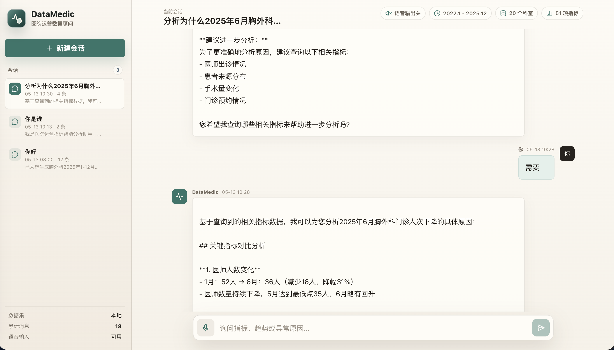
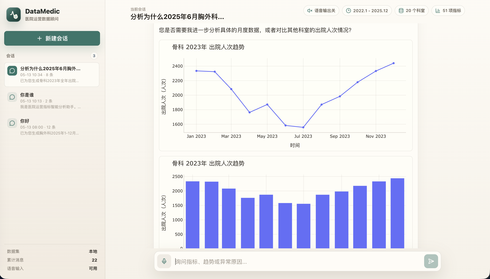
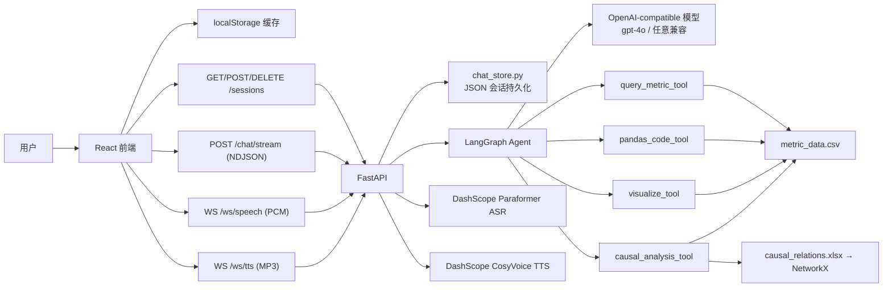

<p align="center">
  
</p>

# DataMedic — 医院运营指标智能分析助手

DataMedic 是一个面向医院运营数据分析的智能问答应用。用户用中文描述分析需求（科室指标查询、趋势变化、异常原因、多指标关系），系统通过 LangGraph Agent 驱动本地数据工具完成查询、统计、图表生成和因果解释，结果以流式对话、Plotly 图表和语音朗读的形式呈现在 React 前端。

项目内置 2022 年 1 月至 2025 年 12 月的医院运营指标样例数据，覆盖 **20 个科室**、**51 项指标**和 **48,960 条**指标记录，并附带一张包含 51 个节点、49 条边的指标因果关系表用于波动解释。

## 运行效果





---

## 核心能力

| 能力 | 说明 |
| --- | --- |
| 自然语言查询 | 门诊人次、出院人次、手术人次、住院收入、床位使用率等 51 项指标的科室级查询 |
| 多维分析 | 任意科室组合 × 时间范围 × 聚合方式（合计/均值/最大/最小）× 排名 |
| 图表体系 | 趋势折线、面积、柱状对比、分组柱状、堆叠构成、饼图占比、热力分布、散点关系、气泡关系、箱线分布、直方分布、瀑布环比、KPI 指标卡、明细表 |
| 流式输出 | NDJSON 逐 token 推送，前端打字机渲染，图表在文本完成后一次性展示 |
| 会话持久化 | 后端 JSON 文件持久化，前端 localStorage 兜底；刷新页面或重启服务后会话不丢失 |
| 上下文控制 | 每次模型调用只携带最近 10 轮文本对话，历史图表 JSON 不传入模型，避免上下文爆炸 |
| 语音输入 | 浏览器麦克风 → PCM 音频流 → WebSocket → DashScope Paraformer 实时识别 → 文本追加到输入框 |
| 语音输出 | 流式文本按标点断句 → 持久 WebSocket → DashScope CosyVoice TTS → MP3 音频块 → Web Audio API 顺序播放，合成与播放流水线化 |
| 因果分析 | 基于 NetworkX 有向图，自动查找上游因子指标并计算环比变化率，解释波动原因 |
| 科室概览 | 对"分析一下儿科的数据"等宽泛请求，直接生成多指标趋势折线图 + 核心指标汇总表 |

---

## 技术栈

| 层级 | 技术 | 用途 |
| --- | --- | --- |
| 前端框架 | React 19、TypeScript、Vite | SPA 应用壳、组件化 UI |
| 前端图表 | Plotly.js（按需注册 trace 模块） | 渲染后端生成的 Plotly figure JSON |
| 前端语音 | Web Audio API、MediaStream | 麦克风采集、音频解码与播放 |
| 后端框架 | FastAPI、Pydantic、Uvicorn | REST API、WebSocket、请求校验 |
| Agent 框架 | LangGraph（create_agent）、LangChain | LLM 工具编排、对话记忆管理 |
| LLM | OpenAI-compatible Chat API | gpt-4o / 任意兼容模型 |
| 数据分析 | Pandas、Plotly、NetworkX、OpenPyXL | CSV 数据查询、图表生成、因果图遍历 |
| 语音服务 | DashScope Paraformer（ASR）、CosyVoice（TTS） | 实时语音识别与合成 |
| 测试 | Pytest（123 用例）、Vitest + Testing Library + jsdom（47 用例） | 后端单元测试、前端组件测试 |

---

## 项目结构

```text
datamedic/
├── data/
│   ├── metric_data.csv              # 医院运营指标样例数据（48,960 行）
│   └── causal_relations.xlsx        # 指标因果关系定义（51 节点 / 49 边）
│
├── src/datamedic/
│   ├── server.py                    # FastAPI 应用入口：CORS、日志中间件、lifespan
│   ├── config.py                    # 环境变量加载：LLM、语音、数据路径、CORS 白名单
│   ├── chat_store.py                # 后端 JSON 会话持久化（CRUD + 锁 + LRU）
│   │
│   ├── api/
│   │   ├── routes.py                # /chat、/chat/stream、/sessions、/ws/speech、/ws/tts
│   │   └── schemas.py               # Pydantic 请求/响应模型（ChatRequest、ChatResponse 等）
│   │
│   ├── agent/
│   │   ├── agent.py                 # LangGraph Agent 组装：LLM + 4 工具 + LRU MemorySaver
│   │   └── prompts.py               # 系统提示词：动态注入科室列表、指标列表、当前日期
│   │
│   ├── tools/
│   │   ├── query_tool.py            # 结构化指标查询：多科室筛选、聚合、排序、排名
│   │   ├── pandas_tool.py           # 受限 Pandas 代码执行：AST 白名单校验 + SIGALRM 超时
│   │   ├── viz_tool.py              # Plotly 图表生成：14 种图表类型，JSON 序列化
│   │   ├── causal_tool.py           # 因果分析：环比变化计算、因子分类归因
│   │   ├── department_overview.py   # 科室概览：多指标趋势 + 汇总表
│   │   └── validation.py            # 共享参数校验：科室、指标、时间、聚合、图表类型
│   │
│   └── data/
│       ├── loader.py                # CSV 数据加载与缓存（RLock 双检锁）
│       └── causal_graph.py          # NetworkX 因果图构建与查询
│
├── frontend/src/
│   ├── App.tsx                      # 应用壳：侧边栏、聊天线程、输入区、语音控制
│   ├── App.css                      # 全局样式（909 行，CSS 变量 + 响应式）
│   ├── api.ts                       # HTTP/NDJSON 客户端：fetch、stream、session CRUD
│   ├── storage.ts                   # localStorage 会话持久化：CRUD、修复、降级
│   ├── voice.ts                     # 语音客户端：SpeechRecognizer（STT）、SpeechPlayer（TTS）
│   ├── speechSegments.ts            # 文本断句：强/弱标点符号分段，用于 TTS 排队
│   ├── plotly.ts                    # Plotly.js 按需加载：仅注册项目使用的 8 种 trace
│   ├── chartTheme.ts                # 图表主题适配：透明背景、统一配色、hover 样式
│   ├── format.ts                    # 时间格式化工具
│   ├── types.ts                     # 核心类型定义 + isRecord 类型守卫
│   │
│   ├── components/
│   │   ├── Sidebar.tsx              # 侧边栏：会话列表、新建、删除确认
│   │   ├── Composer.tsx             # 消息输入区：文本输入 + 语音按钮
│   │   ├── MessageList.tsx          # 消息列表：过滤空消息、渲染图表面板
│   │   ├── PlotlyPanel.tsx          # 图表面板：异步挂载、主题注入、卸载清理
│   │   ├── Welcome.tsx              # 欢迎页：示例问题快捷输入
│   │   └── StatusPill.tsx           # 状态标签：数据范围、科室数、指标数
│   │
│   └── hooks/
│       └── useChatSession.ts        # 聊天会话 Hook：流式消息、语音分段、状态更新
│
├── tests/                           # 后端测试（123 用例）
│   ├── test_api.py                  # API 端点、流式响应、会话、错误处理
│   ├── test_agent.py                # 系统提示词、LRU MemorySaver
│   ├── test_chat_store.py           # 会话持久化 CRUD
│   ├── test_query_tool.py           # 指标查询工具
│   ├── test_viz_tool.py             # 图表生成工具（14 种类型全覆盖）
│   ├── test_causal_tool.py          # 因果分析工具
│   ├── test_pandas_tool.py          # Pandas 代码执行沙箱
│   ├── test_validation.py           # 参数校验函数
│   ├── test_loader.py               # 数据加载与缓存
│   ├── test_causal_graph.py         # 因果图构建与查询
│   ├── test_department_overview.py  # 科室概览
│   └── conftest.py                  # 共享 fixtures（按需扩展）
│
└── frontend/src/                    # 前端测试（47 用例，与源码同目录）
    ├── App.test.tsx                 # App 组件集成测试
    ├── api.test.ts                  # API 客户端测试
    ├── storage.test.ts              # 存储层测试
    ├── voice.test.ts                # 语音客户端测试
    ├── speechSegments.test.ts       # 断句逻辑测试
    ├── plotly.test.ts               # Plotly 加载器测试
    ├── chartTheme.test.ts           # 图表主题测试
    └── viteConfig.test.ts           # Vite 代理配置测试
```

---

## 系统架构



**数据流概要**：

1. 用户在 React 前端输入问题 → `POST /chat/stream` 发送 `{session_id, message}`
2. 后端将用户消息写入会话 JSON → 构建模型输入（最近 10 轮文本）→ 送入 LangGraph Agent
3. Agent 调用 LLM，LLM 决定调用哪些工具 → 工具执行并返回结果
4. LLM 综合工具结果生成回复 → 回复以 NDJSON 流式推送前端（`delta` 事件携带增量文本）
5. 前端实时更新助手消息气泡；流结束后，后端重建图表 figure JSON 并在 `done` 事件中发送
6. 同时，前端按标点断句 → 持久 WebSocket 发送到 TTS → 音频块顺序播放

---

## 核心实现细节

### 1. Agent 与工具编排

Agent 由 `src/datamedic/agent/agent.py` 组装，使用 LangGraph 的 `create_agent()` 创建：

```
LLM（ChatOpenAI） + 4 个 @tool 工具 + 系统提示词 + LRU MemorySaver
```

**四个工具**：

| 工具 | 函数签名 | 能力 |
| --- | --- | --- |
| `query_metric_tool` | `query_metric(departments, metric_name, year_start, year_end, month_start, month_end, aggregation, sort_by, top_n)` | 单值查询、多科室对比、聚合统计、排名。空科室列表表示全部科室 |
| `pandas_code_tool` | `run_pandas_code(code)` | 在受限环境中执行 Pandas 代码。变量 `df` 为完整数据 DataFrame。AST 白名单禁止文件 I/O、import、循环等；SIGALRM 5 秒超时 |
| `visualize_tool` | `visualize_metric(departments, metric_name, ..., chart_type, aggregation, group_by, secondary_metric_name, size_metric_name, top_n)` | 生成 14 种 Plotly 图表。给 LLM 返回文本摘要，完整 figure JSON 由 API 层重建 |
| `causal_analysis_tool` | `analyze_cause(department, metric_name, year?, month?)` | 基于因果图查找上游因子，计算各因子环比变化率，按类别分组返回。year/month 可省略，自动取最新数据 |

每个工具调用通过 `_timed_tool` 包装，记录执行耗时。系统提示词（`prompts.py`）动态注入可用科室（20 个）、指标（51 个）和当前日期，并包含详细的行为约束和图表选择指导。

**MemorySaver 管理**：使用自定义 `LRUMemorySaver`，限制最多 200 个活跃线程，超出时按 LRU 淘汰并清理内部 storage/writes/blobs，防止内存无限增长。

### 2. 会话持久化

会话持久化由 `chat_store.py` 实现，每个会话保存为独立 JSON 文件：

```text
data/conversations/<url-encoded-session-id>/conversation.json
```

**文件结构**（与前端类型对应）：

```json
{
  "id": "uuid",
  "title": "会话标题（取自首条用户消息前 15 字）",
  "summary": "最近一条消息文本",
  "createdAt": "2026-05-15T00:00:00.000Z",
  "updatedAt": "2026-05-15T00:00:00.000Z",
  "messages": [
    {
      "id": "uuid",
      "role": "user | assistant",
      "text": "消息内容",
      "figures": [{ "data": [], "layout": {} }],
      "createdAt": "2026-05-15T00:00:00.000Z"
    }
  ]
}
```

**关键设计**：

- 写入使用**临时文件 + 原子替换**（`temp_path.replace(path)`），防止半写入导致 JSON 损坏
- 会话目录名使用 URL 编码，防止路径穿越
- 每个会话有独立的 `threading.Lock`，锁池有 LRU 淘汰（上限 500），防止并发写入
- `build_model_messages()` 只取最近 **10 轮**文本对话，历史图表 JSON 不传入模型
- LangGraph `thread_id` 使用 `{session_id}:{message_id}` 格式，每次请求使用临时线程

**前端降级策略**：`App.tsx` 启动时先尝试 `GET /sessions` 从后端恢复会话；如果后端不可用（网络错误），退回 `localStorage`。每次操作优先写后端，后端失败时回退到本地存储。

### 3. 流式聊天

**后端**（`routes.py`）：

1. 收到 `POST /chat/stream` 请求
2. 执行前置拦截：无上下文指代追问检测 → 直接返回引导文案
3. 执行科室概览检测：宽泛单科室请求 → 直接生成概览图表流
4. 调用 LangGraph Agent 的 `astream_events()`，监听两类事件：
   - `on_chat_model_stream`：提取增量文本，即时 yield `{"type": "delta", "text": "..."}`
   - `on_chain_end`（LangGraph）：收集最终消息列表
5. 从最终消息中提取 AI 文本 + 重建图表 figures
6. 写入会话文件 → yield `{"type": "done", "text": "...", "figures": [...]}`
7. 异常时：尝试降级为科室概览（若为递归超限且消息含单科室）→ 否则返回安全错误文本

`POST /chat` 同步端点内部委托给流式处理器，收集所有事件后返回 `ChatResponse`。

**前端**（`api.ts` + `useChatSession.ts`）：

1. `fetch("/chat/stream")` + `ReadableStream.getReader()` 逐块读取
2. 按 `\n` 分割 NDJSON 行，每行解析为 `StreamEvent`
3. `delta` 事件 → 追加文本到助手气泡 + 按标点断句送入 TTS 队列
4. `done` 事件 → 写入最终文本和图表，刷新剩余语音
5. `error` 事件 → 显示错误文本，停止语音播放

### 4. 图表生成流程

Agent 调用 `visualize_tool` 时，工具**只给模型返回文本摘要**（如"已生成趋势线图：心血管内科 2025年 门诊人次趋势。数据范围 1,200 ~ 15,800 人次。"），以减少模型上下文负担。

API 层在流结束后执行**图表重建**：

```python
# routes.py
tool_args_list = _extract_visualize_tool_args(messages)  # 从 AI 消息中提取工具调用参数
figures = []
for tool_args in tool_args_list:
    viz_result = visualize_metric(**tool_args)       # 重新执行工具
    if viz_result.get("figure_json"):
        figures.append(json.loads(viz_result["figure_json"]))
```

- 只重建**最新一轮用户消息之后**的图表调用，防止追问时重复输出历史图表
- 异常工具调用被静默跳过，不影响文本回复

**前端渲染**（`PlotlyPanel.tsx`）：

1. 组件挂载时通过 `requestAnimationFrame` 延迟加载 Plotly.js
2. 调用 `createPlotlyThemePayload()` 注入透明背景、统一配色
3. `Plotly.react()` 渲染到 DOM
4. 组件卸载时 `Plotly.purge()` 清理，防止内存泄漏

**Plotly 按需加载**（`plotly.ts`）：只注册项目实际使用的 8 种 trace 模块（bar、box、heatmap、histogram、indicator、pie、table、waterfall），而非完整 Plotly.js，减少首屏加载体积。

**图表类型选择矩阵**：

| 分析意图 | 推荐图表 | 关键参数 |
| --- | --- | --- |
| 趋势、走势、变化 | `line`、`area` | group_by: month/year |
| 比较、排名 | `bar`、`grouped_bar` | - |
| 构成、占比 | `pie`、`stacked_bar` | - |
| 热点、异常分布 | `heatmap` | - |
| 双指标关系 | `scatter` | secondary_metric_name（必填） |
| 关系 + 规模 | `bubble` | secondary_metric_name + size_metric_name |
| 波动、离散程度 | `box`、`histogram` | - |
| 环比变化拆解 | `waterfall` | 仅支持单科室 |
| KPI 概览 | `indicator` | - |
| 明细列表 | `table` | top_n 限制行数 |

### 5. 数据工具实现

**query_tool** — 结构化查询引擎：
- 支持多科室筛选（空列表 → 全科室）、时间范围过滤、聚合（sum/avg/max/min）、排序（value_asc/value_desc）、Top-N 排名
- 单行结果返回自然语言描述（"骨科2025年6月门诊人次为12,000人次"）
- 多行结果返回格式化列表
- 聚合 + 排名模式返回带序号的排名表

**pandas_tool** — 受限代码执行沙箱：
- AST 白名单校验：禁止 import、文件 I/O、循环、函数定义、类、异常处理等
- 内置函数白名单：仅允许安全函数（abs、len、sum、sorted 等）
- SIGALRM 5 秒超时（主线程）或 threading.Timer 兜底
- 结果通过 `result` 变量传递

**causal_tool** — 因果关系分析：
- 从 NetworkX 有向图中查找目标指标的所有上游因子
- 按类别分组，计算每个因子的当月值、上月值和环比变化率
- 自动检测最新可用月份（year/month 参数可选）
- 输出结构化 JSON，包含 `drilldown_available` 提示可进一步下钻的因子

### 6. 参数校验体系

`validation.py` 提供所有工具共享的校验函数，在工具入口统一调用：

| 校验函数 | 校验内容 |
| --- | --- |
| `validate_period` | 月份 1-12、开始 ≤ 结束 |
| `validate_metric` | 指标名称在已知指标列表中 |
| `validate_department_name` | 科室名称在已知科室列表中 |
| `normalize_departments` | 科室列表规范化：去空白、去重、未知科室报错、空列表 → 全科室 |
| `validate_aggregation` | 聚合方式 ∈ {none, sum, avg, max, min} |
| `validate_sort` | 排序方式 ∈ {none, value_asc, value_desc} |
| `validate_chart_type` | 图表类型 ∈ 14 种支持类型 |
| `validate_group_by` | 分组方式 ∈ {month, year, department} |
| `validate_top_n` | top_n ≥ 0 |

### 7. 语音链路

**语音输入**（`SpeechRecognizer`）：

```
浏览器麦克风 → MediaStream → ScriptProcessorNode(4096)
→ Float32 → Int16 PCM → WebSocket /ws/speech
→ DashScope Paraformer → 识别文本回调 → 前端输入框
```

- 中间识别结果（`is_final=false`）显示为"正在聆听"提示
- 最终结果（`is_final=true`）追加到输入框末尾，不覆盖用户已输入文本
- 识别出错或 WebSocket 断开时自动停止所有资源（MediaStream、AudioContext、WebSocket）

**语音输出**（`SpeechPlayer`）：

```
流式文本增量 → speechSegments 断句（强标点直接断，弱标点满足最小长度后断）
→ 片段队列 → 持久 WebSocket /ws/tts → DashScope CosyVoice
→ MP3 音频块 → decodeAudioData → AudioBufferSourceNode 顺序播放
```

- **持久 WebSocket**：整个播放周期只建立一个 TTS 连接，消除每段新建连接的开销
- **合成与播放流水线化**：当前片段播放期间，后台预合成下一片段的音频
- 用户发送新消息或关闭语音输出时，取消当前播放和等待中的队列

**断句策略**（`speechSegments.ts`）：

| 断句类型 | 标点 | 条件 |
| --- | --- | --- |
| 强断句 | `。！？!?；;` | 立即断句 |
| 弱断句 | `，,、：:` | 片段 ≥ 22 字符后断句 |

### 8. 前置拦截与降级

API 层在调用 Agent 前执行多层拦截，减少不必要的 LLM 调用：

**无上下文指代追问检测**（`_detect_vague_reference_request`）：
- 消息含指代词（"这种"、"这个"、"该变化"）且含因果意图（"为什么"、"原因"、"下降"）
- 但未指明具体指标名称，且历史中无图表上下文
- → 直接返回引导文案，不送入 Agent

**科室概览检测**（`detect_department_overview_request`）：
- 消息提到单一科室，含宽泛术语（"分析"、"数据"、"情况"、"看看"、"概况"等）
- 未指定具体指标
- → 直接生成多指标趋势图 + 汇总表，不经过 Agent

**递归超限降级**（`_department_overview_after_recursion_error`）：
- Agent 抛出 `GRAPH_RECURSION_LIMIT` 错误
- 且消息含单科室但无具体指标
- → 降级为科室概览，避免直接返回错误

### 9. 数据层设计

**loader.py** — CSV 数据加载：
- 首次访问时加载 `metric_data.csv`（48,960 行），生成 `date` 辅助列（如 "2025-06"）
- 模块级缓存 + `threading.RLock` 双检锁保证线程安全
- `get_departments()` 和 `get_metrics()` 从缓存 DataFrame 派生，无需重复 I/O

**causal_graph.py** — 因果图构建：
- 从 `causal_relations.xlsx` 读取 49 条因果关系
- 构建 NetworkX 有向图（因子 → 结果），边属性含类别
- `get_factors(G, metric_name)`：查询上游因子，按类别分组
- `get_drilldown(G, metric_name)`：识别可进一步下钻的中间节点
- 同样使用 RLock 双检锁缓存

---

## API 概览

| 方法 | 路径 | 请求体 | 响应 |
| --- | --- | --- | --- |
| `GET` | `/health` | - | `{"status": "ok"}` |
| `POST` | `/chat` | `ChatRequest` | `ChatResponse`（JSON） |
| `POST` | `/chat/stream` | `ChatRequest` | `application/x-ndjson` 流 |
| `GET` | `/sessions` | - | `list[ConversationRecord]` |
| `POST` | `/sessions` | - | `ConversationRecord` |
| `DELETE` | `/sessions/{id}` | - | `{"ok": true}` |
| `WS` | `/ws/speech` | 二进制 PCM 音频帧 | JSON 识别结果 |
| `WS` | `/ws/tts` | JSON `{"text": "..."}` | 二进制 MP3 + JSON 状态 |

**ChatRequest**：
```json
{
  "session_id": "conversation-uuid",
  "message": "展示 2025 年骨科出院人次趋势"
}
```

**NDJSON 流式事件**：
```json
{"type": "delta", "text": "增量文本"}
{"type": "done", "text": "完整回复文本", "figures": [{ "data": [...], "layout": {...} }]}
{"type": "error", "text": "错误说明"}
```

---

## 快速开始

### 环境要求

- Python 3.11+（推荐 3.12+）
- Node.js 18+、npm
- OpenAI-compatible 聊天模型服务（API Key + Base URL）
- DashScope API Key（语音输入/输出需要，文本分析不需要）

### 安装与配置

```bash
# 1. 克隆项目
git clone <repo-url> && cd datamedic

# 2. 后端依赖
python3 -m venv .venv && source .venv/bin/activate
pip install -e ".[dev]"
# 或使用 uv: uv sync

# 3. 环境变量
cp .env.example .env
# 编辑 .env，填入 OPENAI_API_KEY、OPENAI_BASE_URL、MODEL_NAME
# 语音功能需填入 DASHSCOPE_API_KEY

# 4. 前端依赖
cd frontend && npm install
```

关键环境变量：

```bash
# LLM
OPENAI_API_KEY=sk-your-key
OPENAI_BASE_URL=https://api.openai.com/v1
MODEL_NAME=gpt-4o

# 语音（可选）
DASHSCOPE_API_KEY=sk-your-key
STT_MODEL=paraformer-realtime-v2
TTS_MODEL=cosyvoice-v2
TTS_VOICE=longxiaochun_v2

# 数据路径（可选）
CONVERSATION_DATA_DIR=data/conversations
CORS_ALLOW_ORIGINS=http://localhost:5173,http://127.0.0.1:5173
LOG_LEVEL=INFO
```

### 启动

```bash
# 终端 1：后端
source .venv/bin/activate
uvicorn datamedic.server:app --host 127.0.0.1 --port 8000 --reload

# 终端 2：前端
cd frontend && npm run dev
```

访问 `http://localhost:5173`。Vite 开发服务器自动代理 `/chat`、`/sessions`、`/health`、`/ws/speech`、`/ws/tts` 到 `localhost:8000`。

### 测试

```bash
# 后端（123 用例）
python3 -m pytest tests/ -v

# 前端（47 用例）
cd frontend && npx vitest run
```

---

## 开发约定

- **分层原则**：API 层只做请求编排和前置拦截；业务逻辑在 `tools/`、`chat_store.py`、`data/` 中
- **图表协议**：图表始终以 Plotly figure JSON 格式保存和传输，前后端无需额外协议
- **会话事实来源**：后端 JSON 文件是持久化事实来源；`localStorage` 是前端缓存和后端不可用时的兜底
- **错误安全**：所有面向用户的错误消息不泄露内部路径、token 或技术细节
- **测试覆盖**：重点关注工具参数校验、图表生成、会话持久化、流式响应解析、语音队列、前端状态恢复
- **类型安全**：前端 TypeScript 严格类型检查（`tsc --noEmit`），后端 Pydantic 模型校验

---

## 示例提问

- "展示 2025 年骨科出院人次趋势。"
- "比较心内科和心外科 2024 年手术人次。"
- "找出 2025 年门诊人次最高的前 5 个科室。"
- "分析住院收入和出院人次之间的关系。"
- "为什么骨科 2025 年 6 月出院人次下降？"
- "分析一下儿科的数据。"
- "用热力图展示各科室 2025 年床位使用率分布。"
- "生成心血管内科 2025 年门诊人次的瀑布图。"
