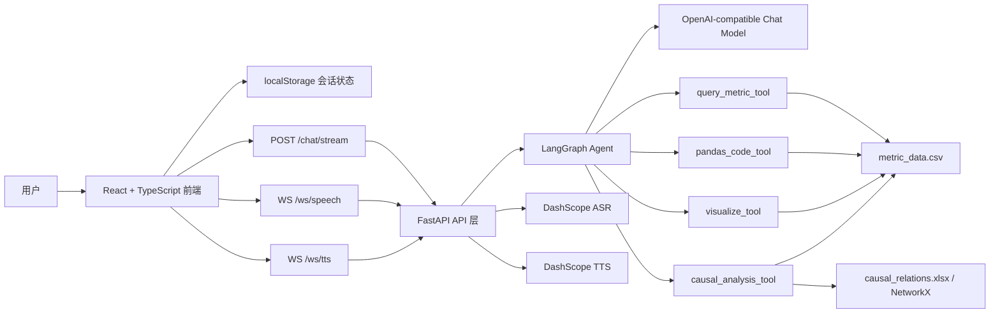

<p align="center">
  
</p>

# DataMedic 医院运营指标智能分析助手

DataMedic 是一个面向医院运营指标分析场景的智能问答应用。项目通过 React + TypeScript 构建现代化前端，通过 FastAPI 提供聊天、流式输出、语音识别和语音合成接口，并使用 LangChain/LangGraph 将大模型与本地医院运营数据分析工具串联起来。

系统当前内置 2022 年 1 月至 2025 年 12 月的医院运营指标样例数据，覆盖 20 个科室、51 项指标、48 个月，共 48,960 条指标记录，并提供基于因果关系表的指标变化解释能力。

## 功能特性

- **自然语言指标问答**：支持使用中文查询医院运营指标，例如门诊人次、出院人次、手术人次、住院收入等。
- **多科室、多时间范围分析**：支持按科室、年份、月份筛选数据，支持多科室对比、汇总、平均、最大值、最小值和排名。
- **多轮上下文理解**：前端用会话 ID 管理对话，后端将同一会话映射为 LangGraph `thread_id`，支持用户在追问中省略科室、指标或时间。
- **流式模型回复**：前端调用 `/chat/stream`，后端以 NDJSON 形式返回 `delta` 和 `done` 事件，聊天面板实时展示模型输出。
- **图表自动生成**：模型调用 `visualize_tool` 后，后端返回 Plotly figure JSON，前端以沉浸式透明主题渲染折线图或柱状图。
- **因果分析**：基于 `data/causal_relations.xlsx` 构建有向因果图，分析目标指标变化时相关因子指标的环比变化。
- **Pandas 复杂分析工具**：当结构化查询工具不足以回答问题时，Agent 可调用受限的 Pandas 执行环境完成更复杂的统计分析。
- **会话侧边栏**：前端提供新建会话、切换会话、删除会话、会话摘要和本地持久化能力。
- **语音输入**：浏览器采集麦克风 PCM 音频，通过 WebSocket 发送给后端，后端使用 DashScope Paraformer 实时识别。
- **流式语音输出**：模型文字流式输出时，前端按句子或合适长度短语切分文本，并将语音片段排队发送到 TTS WebSocket，实现边显示边朗读。
- **现代化前端界面**：主前端已从 Streamlit 迁移到 React + TypeScript + Vite，采用更接近现代 AI 对话应用的布局、侧边栏和输入体验。

## 运行效果


## 技术栈

| 层级 | 技术 |
| --- | --- |
| 前端 | React 19、TypeScript、Vite、Lucide React、Plotly.js |
| 后端 | FastAPI、Uvicorn、Pydantic |
| Agent | LangChain、LangGraph、LangGraph MemorySaver、OpenAI-compatible Chat API |
| 数据分析 | Pandas、Plotly、NetworkX、OpenPyXL |
| 语音 | DashScope Paraformer 实时语音识别、DashScope CosyVoice 实时语音合成、Web Audio API |
| 测试 | Pytest、Vitest、Testing Library、jsdom |

## 快速上手

### 1. 环境要求

- Python 3.11 或更高版本
- Node.js 18 或更高版本
- npm
- 可用的 OpenAI-compatible 大模型服务
- 如需语音输入和语音输出，需要 DashScope API Key

项目依赖声明位于：

- 后端：`pyproject.toml`
- 前端：`frontend/package.json`

### 2. 安装后端依赖

推荐在仓库根目录创建并激活虚拟环境：

```bash
python3 -m venv .venv
source .venv/bin/activate
pip install -e ".[dev]"
```

如果你使用 `uv`：

```bash
uv sync
```

### 3. 配置环境变量

复制示例配置：

```bash
cp .env.example .env
```

根据实际服务修改 `.env`：

```bash
OPENAI_API_KEY=sk-your-openai-key
OPENAI_BASE_URL=https://api.openai.com/v1
MODEL_NAME=gpt-4o

DASHSCOPE_API_KEY=sk-your-dashscope-key

STT_MODEL=paraformer-realtime-v2
TTS_MODEL=cosyvoice-v2
TTS_VOICE=longxiaochun_v2
```

说明：

- `OPENAI_BASE_URL` 支持 OpenAI 兼容接口，可接入 OpenAI、代理服务或私有网关。
- `MODEL_NAME` 是聊天模型名称。
- `DASHSCOPE_API_KEY` 用于语音识别和语音合成。
- `TTS_VOICE=longxiaochun_v2` 与 `cosyvoice-v2` 匹配；后端也会兼容旧配置 `longxiaochun` 并自动升级为 `longxiaochun_v2`。

### 4. 安装前端依赖

```bash
cd frontend
npm install
```

### 5. 启动后端

在仓库根目录运行：

```bash
source .venv/bin/activate
uvicorn datamedic.server:app --host 127.0.0.1 --port 8000 --reload
```

健康检查：

```bash
curl http://127.0.0.1:8000/health
```

期望返回：

```json
{"status":"ok"}
```

### 6. 启动前端

另开一个终端：

```bash
cd frontend
npm run dev
```

默认访问：

```text
http://localhost:5173
```

Vite 开发服务器会代理请求到 FastAPI：

- `/chat` -> `http://localhost:8000`
- `/chat/stream` -> `http://localhost:8000`
- `/health` -> `http://localhost:8000`
- `/ws/speech` -> `ws://localhost:8000`
- `/ws/tts` -> `ws://localhost:8000`

## 常用命令

### 前端

```bash
cd frontend
npm run dev
npm test -- --run
npm run build
```

### 后端

```bash
pytest -q
uvicorn datamedic.server:app --host 127.0.0.1 --port 8000 --reload
```

### Streamlit 兼容入口

项目早期使用 Streamlit。当前主前端已经迁移到 `frontend/`，`src/datamedic/app.py` 仅保留迁移提示页：

```bash
streamlit run src/datamedic/app.py
```

## 项目结构

```text
datamedic/
├── data/
│   ├── metric_data.csv                 # 医院运营指标明细数据
│   ├── causal_relations.xlsx           # 指标因果关系定义
│   └── sample.csv
├── frontend/
│   ├── src/
│   │   ├── App.tsx                     # 主应用、会话侧边栏、聊天面板、图表渲染
│   │   ├── App.css                     # 现代化界面样式
│   │   ├── api.ts                      # HTTP 流式聊天客户端
│   │   ├── storage.ts                  # 前端本地会话持久化
│   │   ├── voice.ts                    # 语音输入和语音输出客户端
│   │   └── types.ts                    # 前端领域类型
│   ├── package.json
│   └── vite.config.ts                  # Vite 与后端代理配置
├── src/datamedic/
│   ├── agent/
│   │   ├── agent.py                    # LangGraph Agent 与工具注册
│   │   └── prompts.py                  # 系统提示词构建
│   ├── api/
│   │   ├── routes.py                   # Chat、流式 Chat、STT、TTS API
│   │   └── schemas.py                  # API 请求响应模型
│   ├── data/
│   │   ├── loader.py                   # 指标数据加载与缓存
│   │   └── causal_graph.py             # 因果图构建与查询
│   ├── tools/
│   │   ├── query_tool.py               # 结构化指标查询工具
│   │   ├── pandas_tool.py              # 受限 Pandas 分析工具
│   │   ├── viz_tool.py                 # Plotly 图表生成工具
│   │   └── causal_tool.py              # 因果分析工具
│   ├── config.py                       # 环境变量与路径配置
│   ├── server.py                       # FastAPI 应用入口
│   └── app.py                          # Streamlit 迁移提示入口
├── tests/                              # 后端单元测试
├── pyproject.toml
└── README.md
```

## 系统架构



前端负责用户体验、会话列表、本地消息存储、图表展示、语音采集和音频播放。后端负责模型编排、数据工具调用、流式事件输出、语音识别和语音合成。

## 前后端交互方式

### 非流式聊天接口

```http
POST /chat
Content-Type: application/json
```

请求体：

```json
{
  "session_id": "conversation-id",
  "message": "展示 2025 年骨科出院人次趋势"
}
```

响应体：

```json
{
  "text": "分析结果文本",
  "figures": []
}
```

该接口适合简单调用或测试。主前端默认使用流式接口。

### 流式聊天接口

```http
POST /chat/stream
Content-Type: application/json
Accept: application/x-ndjson
```

后端返回 `application/x-ndjson`，每行是一个 JSON 事件。

文本增量事件：

```json
{"type":"delta","text":"第一段文字"}
```

完成事件：

```json
{"type":"done","text":"完整回复","figures":[]}
```

错误事件：

```json
{"type":"error","text":"错误说明"}
```

前端 `frontend/src/api.ts` 使用 `ReadableStream.getReader()` 逐块读取响应，通过 `TextDecoder` 按行解析 NDJSON：

1. 收到 `delta` 时，将文本增量追加到当前助手消息。
2. 收到 `done` 时，用最终文本和图表列表更新消息。
3. 收到 `error` 时，显示错误文案。

### 图表数据返回

当 Agent 调用 `visualize_tool` 时：

1. 工具返回给模型的是图表摘要文本。
2. API 层从 LangGraph 消息中提取 `visualize_tool` 的调用参数。
3. 后端再次调用 `visualize_metric(...)` 生成 Plotly figure JSON。
4. `/chat` 或 `/chat/stream` 的响应中通过 `figures` 返回图表。
5. 前端 `PlotlyPanel` 使用 `plotly.js-dist-min` 动态导入并调用 `Plotly.react(...)` 渲染。

前端会对 Plotly figure 做主题处理：

- `paper_bgcolor` 和 `plot_bgcolor` 设置为透明。
- 坐标轴、网格、hover label、表格 header/cell 使用与聊天面板一致的浅色主题。
- `displayModeBar` 默认关闭，`responsive` 默认开启。

## 会话和多轮对话实现

DataMedic 的会话体系分为前端状态和后端模型记忆两个层次。

### 前端本地会话

实现文件：`frontend/src/storage.ts`

前端使用 `localStorage` 保存会话状态，键名为：

```text
datamedic.conversations.v1
```

核心数据结构：

```ts
interface ConversationState {
  activeId: string;
  conversations: Conversation[];
}

interface Conversation {
  id: string;
  title: string;
  summary: string;
  createdAt: string;
  updatedAt: string;
  messages: ChatMessage[];
}
```

行为：

- 首次打开应用时自动创建一个空会话。
- 新建会话会生成新的 `id` 并置为当前会话。
- 第一条用户消息会自动生成会话标题。
- 每次追加或更新消息都会写回 `localStorage`。
- 删除会话需要二次确认，删除当前会话后自动切换到剩余第一条会话；如果没有剩余会话，则自动创建新会话。

### 后端多轮上下文

实现文件：`src/datamedic/agent/agent.py`

后端使用 LangGraph 的 `MemorySaver` 作为 checkpointer：

```python
checkpointer = MemorySaver()
```

前端每次请求都会携带 `session_id`。API 层将它映射为 LangGraph 配置中的 `thread_id`：

```python
config = {"configurable": {"thread_id": request.session_id}}
```

这样同一前端会话中的多次提问会进入同一个 LangGraph 线程，模型可以利用历史消息进行上下文推断，例如：

- 用户先问“展示骨科 2025 年出院人次趋势”
- 后续追问“那和心内科相比呢？”
- Agent 可以从同一 `thread_id` 的历史上下文中推断“那”指前一个指标和时间范围

需要注意：当前后端 `MemorySaver` 是内存型 checkpointer，服务重启后后端模型记忆会丢失；前端 `localStorage` 中的会话消息仍会保留。若需要生产级持久化，可以替换为数据库型 LangGraph checkpointer，并将前端会话与后端线程状态统一持久化。

## 数据检索与分析方案

### 数据集

指标数据文件：`data/metric_data.csv`

字段：

| 字段 | 含义 |
| --- | --- |
| 科室 | 科室名称 |
| 指标编码 | 指标唯一编码 |
| 指标名称 | 指标中文名称 |
| 年份 | 年份 |
| 月份 | 月份 |
| 数值 | 指标值 |
| 指标单位 | 指标单位 |

当前数据范围：

- 科室：20 个
- 指标：51 项
- 时间：2022 年 1 月至 2025 年 12 月
- 记录数：48,960 条

因果关系文件：`data/causal_relations.xlsx`

字段：

- `结果指标编码`
- `结果指标名称`
- `结果指标备注`
- `类别`
- `因子指标编码`
- `因子指标名称`
- `因子指标备注`

### 数据加载

实现文件：`src/datamedic/data/loader.py`

`load_metric_data()` 会读取 CSV，并补充 `date` 字段：

```text
YYYY-MM
```

为了减少重复 IO，模块内使用缓存变量保存：

- 指标 DataFrame
- 科室列表
- 指标列表

系统提示词构建时会调用 `get_departments()` 和 `get_metrics()`，将可用科室、指标编码、指标名称和单位注入到 Agent 的系统提示词中，降低模型调用不存在指标的概率。

### 结构化指标查询

实现文件：`src/datamedic/tools/query_tool.py`

Agent 工具名：`query_metric_tool`

能力：

- 按科室列表查询，空列表表示全部科室。
- 按指标名称查询。
- 按年份和月份筛选。
- 支持 `sum`、`avg`、`max`、`min` 聚合。
- 支持按值升序或降序排序。
- 支持 `top_n` 排名。

适合问题：

- “2025 年骨科出院人次是多少？”
- “比较心内科与心外科 2024 年手术人次。”
- “2025 年门诊人次最高的前 5 个科室。”
- “2022 到 2025 年各科室住院收入平均值排名。”

### Pandas 复杂分析

实现文件：`src/datamedic/tools/pandas_tool.py`

Agent 工具名：`pandas_code_tool`

当结构化查询不足以表达复杂统计逻辑时，Agent 可以生成 Pandas 代码执行。执行环境提供：

- `df`：完整指标数据 DataFrame
- `pd`：pandas 模块

约束：

- 必须将最终结果赋值给 `result`。
- 禁止 `import`、`open()`、`exec()`、`eval()`、`__`、`os.`、`sys.`、`subprocess` 等危险操作。
- 执行超时时间为 5 秒。
- 使用受限 `SAFE_BUILTINS`。

适合问题：

- “找出门诊人次连续三个月下降的科室。”
- “计算住院收入和出院人次之间的相关性。”
- “找出 2025 年同比增幅最大的指标组合。”

### 可视化分析

实现文件：`src/datamedic/tools/viz_tool.py`

Agent 工具名：`visualize_tool`

能力：

- 生成折线图：`chart_type="line"`
- 生成柱状图：`chart_type="bar"`
- 支持多科室、多月份、多年份趋势展示
- 返回 Plotly figure JSON 和摘要文本

后端 API 层会将 figure JSON 放入聊天响应的 `figures` 数组，前端负责渲染。

### 因果分析

实现文件：

- `src/datamedic/data/causal_graph.py`
- `src/datamedic/tools/causal_tool.py`

Agent 工具名：`causal_analysis_tool`

实现流程：

1. 从 `causal_relations.xlsx` 读取结果指标与因子指标关系。
2. 使用 NetworkX 构建有向图，边方向为“因子指标 -> 结果指标”。
3. 当用户询问“为什么某指标上升/下降”时，查找该指标的前置因子。
4. 对目标指标和相关因子指标计算当前月份相对上一月份的变化率。
5. 按关系类别输出结构化 JSON，供模型组织成自然语言解释。
6. 如果因子指标本身也可继续下钻，会在结果中提供 `drilldown_available`。

适合问题：

- “为什么骨科 2025 年 6 月出院人次下降？”
- “心内科住院收入变化可能由哪些因素导致？”
- “这个指标还能继续下钻分析吗？”

## Agent 实现

实现文件：`src/datamedic/agent/agent.py`

Agent 基于 LangChain `create_agent(...)` 创建，使用：

- ChatOpenAI 兼容模型
- 系统提示词
- 四个本地工具
- LangGraph checkpointer

注册工具：

```python
tools = [
    query_metric_tool,
    pandas_code_tool,
    visualize_tool,
    causal_analysis_tool,
]
```

系统提示词由 `src/datamedic/agent/prompts.py` 动态构建，包含：

- 助手角色定义
- 可用科室
- 可用指标、编码、单位
- 数据范围
- 行为约束
- 因果分析指导
- 当前日期语义

模型被要求在数据不足时诚实说明限制，并将无关问题引导回医院运营分析主题。

## 语音输入实现

语音输入链路由前端 `SpeechRecognizer` 和后端 `/ws/speech` WebSocket 共同完成。

### 前端

实现文件：`frontend/src/voice.ts`

流程：

1. 用户点击输入框左侧麦克风按钮。
2. 浏览器调用 `navigator.mediaDevices.getUserMedia(...)` 获取麦克风音频。
3. 前端创建 `AudioContext({ sampleRate: 16000 })`。
4. 使用 `ScriptProcessorNode` 读取音频帧。
5. 将 Float32 音频转换为 Int16 PCM。
6. 通过 WebSocket 发送二进制音频帧到 `/ws/speech`。
7. 接收后端识别文本：
   - `text`：识别内容
   - `is_final`：是否为一句最终结果
8. 最终识别片段会追加到输入框中，而不是覆盖已有文本。

### 后端

实现文件：`src/datamedic/api/routes.py`

接口：

```text
WS /ws/speech
```

流程：

1. 接受 WebSocket 连接。
2. 初始化 DashScope `Recognition`。
3. 配置：
   - `model=STT_MODEL`
   - `format="pcm"`
   - `sample_rate=16000`
4. 接收前端二进制音频帧。
5. 调用 `recognition.send_audio_frame(audio_data)`。
6. DashScope 回调触发时，后端向前端发送 JSON：

```json
{
  "text": "识别文本",
  "is_final": true
}
```

如果识别失败，后端发送：

```json
{
  "error": "错误说明"
}
```

## 语音输出实现

语音输出链路由前端 `SpeechPlayer` 和后端 `/ws/tts` WebSocket 共同完成。

### 后端 TTS

实现文件：`src/datamedic/api/routes.py`

接口：

```text
WS /ws/tts
```

请求消息：

```json
{
  "text": "需要合成的文本"
}
```

后端流程：

1. 接受 WebSocket 连接。
2. 初始化 DashScope `SpeechSynthesizer`。
3. 使用配置：
   - `TTS_MODEL`
   - `TTS_VOICE`
   - `AudioFormat.MP3_22050HZ_MONO_256KBPS`
4. 调用 `streaming_call(text)` 和 `streaming_complete()`。
5. TTS 回调 `on_data` 中向前端发送 MP3 bytes。
6. TTS 回调 `on_complete` 中发送：

```json
{"status":"complete"}
```

7. TTS 回调 `on_error` 中发送：

```json
{"error":"错误说明"}
```

### 前端 TTS 播放

实现文件：`frontend/src/voice.ts`

`SpeechPlayer` 负责：

- 在用户点击语音输出开关时调用 `unlock()` 解锁浏览器音频播放。
- 通过 WebSocket 发送文本到 `/ws/tts`。
- 收集后端返回的 MP3 二进制帧。
- 使用 Web Audio API 解码音频。
- 创建 `AudioBufferSourceNode` 并播放。

### 流式语音输出

实现文件：`frontend/src/App.tsx`

为了避免“文字输出完成后才开始朗读”的延迟，前端实现了分段入队策略：

1. `/chat/stream` 每收到一个 `delta`，立即追加到页面中的助手消息。
2. 同一段 delta 也进入语音缓冲区。
3. 缓冲区遇到强停顿标点时立即切段：
   - `。`
   - `！`
   - `？`
   - `!`
   - `?`
   - `；`
   - `;`
4. 缓冲区遇到软停顿标点时，只有片段达到最小长度才切段：
   - `，`
   - `,`
   - `、`
   - `：`
   - `:`
5. 每个可朗读片段通过 `SpeechPlayer.enqueue(...)` 进入语音队列。
6. `SpeechPlayer` 保证前一段播放完成后才合成和播放下一段，避免多个片段抢播或乱序。
7. 模型响应结束时，前端只补播尚未播出的尾部文本，避免重复朗读完整回复。

这使得用户看到模型回复逐字或逐段出现时，语音也会尽快跟随开始播放。

## 前端界面实现

主界面实现文件：`frontend/src/App.tsx`

主要区域：

- 左侧会话侧边栏
  - 品牌标识
  - 新建会话按钮
  - 会话列表
  - 悬停显示删除按钮
  - 删除二次确认
  - 本地数据集与累计消息信息
- 右侧聊天工作区
  - 当前会话标题
  - 语音输出开关
  - 数据范围状态
  - 对话内容区域
  - 欢迎态问题示例
  - 用户消息和助手消息
  - Plotly 图表面板
  - 底部输入框
  - 输入框左侧语音输入按钮
  - 输入框右侧发送按钮

样式实现文件：`frontend/src/App.css`

设计目标：

- 保持医疗运营工具的专业感和可读性。
- 采用温暖浅色背景和清晰的面板层次。
- 使用弹性布局适配不同视口宽度。
- 会话侧边栏更接近成熟 AI 对话产品的组织方式。
- 图表背景透明，与聊天面板背景融合。

## API 总览

| 方法 | 路径 | 说明 |
| --- | --- | --- |
| `GET` | `/health` | 后端健康检查 |
| `POST` | `/chat` | 非流式聊天 |
| `POST` | `/chat/stream` | NDJSON 流式聊天 |
| `WS` | `/ws/speech` | 实时语音识别 |
| `WS` | `/ws/tts` | 实时语音合成 |

## 测试

### 后端测试

```bash
pytest -q
```

覆盖范围包括：

- FastAPI 健康检查和流式接口
- Agent 文本提取与工具调用参数提取
- 指标数据加载
- 结构化指标查询
- Pandas 工具安全限制
- Plotly 可视化工具
- 因果图与因果分析工具

### 前端测试

```bash
cd frontend
npm test -- --run
```

覆盖范围包括：

- 会话创建、切换、删除确认
- 本地会话存储
- 流式聊天客户端
- Plotly 透明主题处理
- 语音输入追加逻辑
- 语音输出开关行为
- 流式文本形成可朗读片段后立即入队语音播放
- TTS 播放队列顺序

### 生产构建

```bash
cd frontend
npm run build
```

构建产物位于 `frontend/dist/`。

注意：Plotly 包体较大，Vite 生产构建可能提示 chunk size warning。这是 Plotly 依赖体积导致的警告，不代表构建失败。

## 数据与配置扩展

### 替换指标数据

替换 `data/metric_data.csv` 时，需要保持字段名一致：

```text
科室,指标编码,指标名称,年份,月份,数值,指标单位
```

如果科室、指标或时间范围发生变化，需要同步检查：

- `src/datamedic/agent/prompts.py` 中的数据范围说明
- 测试用例中对科室数量、指标数量或年份的假设
- 前端状态栏展示的数据范围

### 替换因果关系

替换 `data/causal_relations.xlsx` 时，需要保持字段名一致：

```text
结果指标编码,结果指标名称,结果指标备注,类别,因子指标编码,因子指标名称,因子指标备注
```

因果关系方向为：

```text
因子指标 -> 结果指标
```

如果一个因子指标同时也是其他关系中的结果指标，系统会将其视为可继续下钻的指标。

### 更换模型服务

只要目标服务兼容 OpenAI Chat Completions 接口，通常只需修改：

```bash
OPENAI_API_KEY=...
OPENAI_BASE_URL=...
MODEL_NAME=...
```

建议选择具备较强工具调用能力和中文理解能力的模型。

## 常见问题

### 前端提示无法连接后端

确认 FastAPI 已启动：

```bash
curl http://127.0.0.1:8000/health
```

确认前端开发服务器的代理配置仍指向 `localhost:8000`。

### 语音输入不可用

检查：

- 浏览器是否允许麦克风权限。
- 页面是否运行在浏览器允许使用麦克风的上下文中。
- `.env` 是否配置 `DASHSCOPE_API_KEY`。
- 后端日志是否出现 DashScope STT 错误。

### 语音输出失败

检查：

- `.env` 中 `DASHSCOPE_API_KEY` 是否有效。
- `TTS_MODEL` 与 `TTS_VOICE` 是否匹配。
- 当前默认推荐配置为：

```bash
TTS_MODEL=cosyvoice-v2
TTS_VOICE=longxiaochun_v2
```

如果浏览器阻止自动播放，请先点击右上角语音输出按钮。前端会在用户手势中调用 Web Audio `resume()` 来解锁播放。

### 图表背景与聊天面板不一致

前端会在渲染前对 Plotly figure 进行主题合并，将 `paper_bgcolor` 和 `plot_bgcolor` 设置为透明。若新增图表类型或自定义 Plotly 配置，需要确认没有在 figure 内强制覆盖为纯白背景。

### 后端重启后模型忘记上下文

当前 LangGraph checkpointer 使用内存实现 `MemorySaver`，后端进程重启后会丢失模型线程记忆。前端本地会话仍在，但后端不会自动恢复这些历史消息。生产环境建议改为持久化 checkpointer。

## 开发说明

- 手动编辑代码时请保持前后端类型结构一致。
- API 响应中的 `figures` 应保持为 Plotly figure JSON 数组。
- 新增后端工具后，需要在 `src/datamedic/agent/agent.py` 中注册，并在系统提示词中补充使用边界。
- 新增数据字段后，需要同步更新 loader、工具函数和测试。
- 修改语音链路时，请同时覆盖：
  - WebSocket 错误处理
  - 浏览器音频解锁
  - 队列顺序
  - 停止播放和组件卸载清理

## 当前状态

主前端已经迁移至：

```text
frontend/
```

后端主入口为：

```text
src/datamedic/server.py
```

Streamlit 文件仍保留，但仅作为迁移提示，不再承载主要交互体验。
